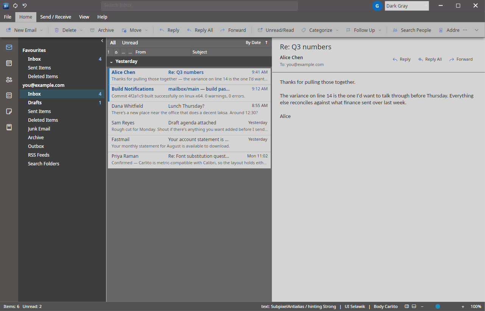
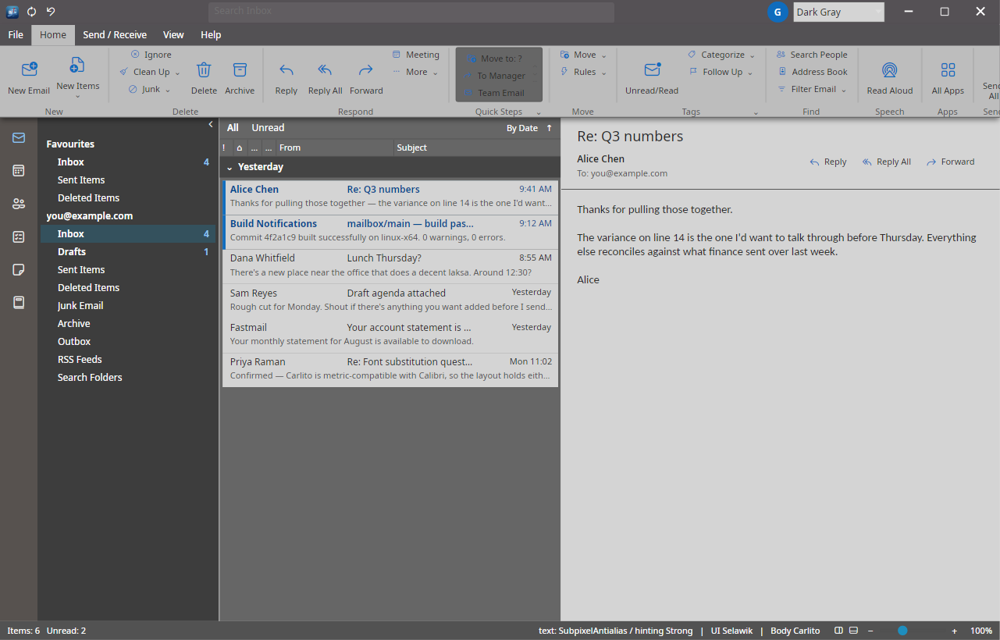
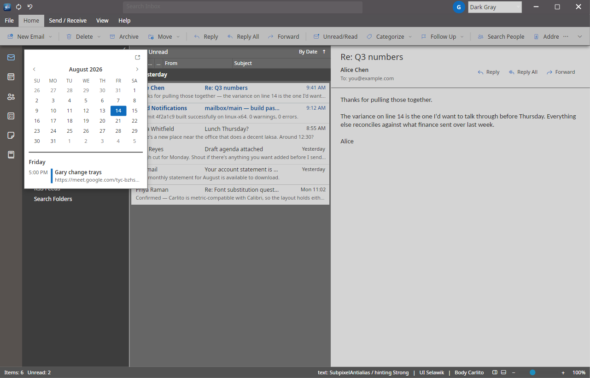
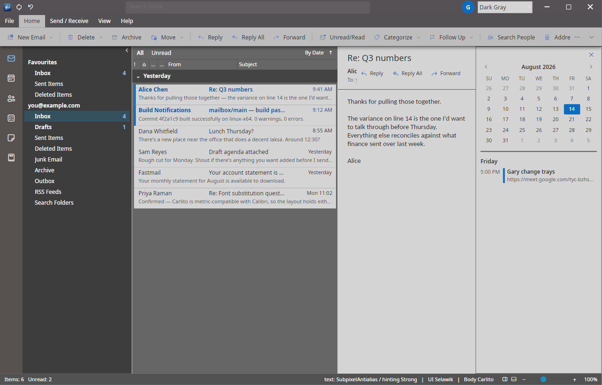

# Mailbox

An email client for everyone.

Classic Outlook, cloned properly, for Linux.

All six modules — Mail, Calendar, People, Tasks, Notes, Journal. No Microsoft cloud
integration, no AI features, no telemetry. Everything a personal user needs, nothing a tenant
admin does.

**Status: Phase 0 of 17, plus the ribbon from Phase 1.** The shell runs, the ribbon renders
from a layout document, and everything is styled from the token system. It does not send or
receive mail yet — that is Phase 2. See [`docs/PLAN.md`](docs/PLAN.md).

**Simplified ribbon** — the Microsoft 365 default, and Mailbox's:



**Classic ribbon** — grouped, labelled, with the Quick Steps gallery. Switched from the
chevron at the right of the bar, exactly as Outlook does it:



**Calendar peek, floating and docked** — the peek carries a small button in its corner that
pins it down the right-hand edge, where it takes the reading pane's place until closed:




---

## The rule

Every scope question resolves against this:

1. **Outlook has it → build it.** A licence conflict or a gap in Avalonia is an implementation
   problem, never a reason to reduce scope.
2. **Outlook has it but it's Windows-shaped → build the Linux-native equivalent.** COM add-ins
   become a .NET plugin API; registry associations become desktop files and MIME types; DPAPI
   becomes Secret Service; PST-only import becomes PST *and* Maildir.
3. **Outlook lacks it but a 2026 mail client is broken without it → add it, shaped the way
   Outlook would have shaped it.**
4. **Outlook does it badly → do it correctly, and record the divergence.**
5. **The default state is the clone; customization is the escape valve.** Additions are real,
   visible, first-class commands — they simply aren't on the default ribbon. Fidelity is
   protected by what appears at first run, never by hiding capability.

---

## Building

Requires the .NET 10 SDK.

```sh
dotnet build
dotnet test
dotnet run --project src/Mailbox.App
```

### Fonts

Mailbox renders mail at the metrics the sender intended by substituting metric-compatible
faces. Install these so Calibri and Cambria mail — which is most business mail — lays out
correctly:

```sh
# Arch
sudo pacman -S --needed ttf-carlito ttf-caladea ttf-liberation

# Debian / Ubuntu
sudo apt install fonts-crosextra-carlito fonts-crosextra-caladea fonts-liberation2
```

If you have the real Microsoft fonts installed, Mailbox detects and prefers them
automatically. It never ships them — they are not redistributable.

### Environment variables

Useful while the UI is still being built.

| Variable | Values | Purpose |
|---|---|---|
| `MAILBOX_THEME` | `colorful`, `white`, `darkgray`, `black` | Startup theme |
| `MAILBOX_DENSITY` | `compact`, `cozy`, `comfortable` | Startup density |
| `MAILBOX_LAYOUT` | `classic`, `modern` | Which generation of Outlook the shell imitates |
| `MAILBOX_RIBBON` | `simplified`, `classic`, `collapsed` | Ribbon display mode |
| `MAILBOX_PEEK` | `calendar`, `docked` | Opens a peek state the harness cannot click to |
| `MAILBOX_TEXT_MODE` | `subpixel`, `antialias`, `alias`, `unspecified` | Glyph rasterization |
| `MAILBOX_TEXT_HINTING` | `none`, `light`, `strong`, `unspecified` | Hinting strength |
| `MAILBOX_CAPTURE` | a `.png` path | Render the window once and exit — the fidelity harness |
| `MAILBOX_CAPTURE_SCALE` | e.g. `1.5`, `2` | Capture at a DPI scale |

Capture runs in-process rather than through a desktop screenshot tool, so it works headlessly
in CI, ignores compositors and portal prompts, and renders at an exact size:

```sh
for t in colorful white darkgray black; do
  MAILBOX_THEME=$t MAILBOX_CAPTURE="shots/$t.png" dotnet run --project src/Mailbox.App
done
```

---

## Layout

```
src/Mailbox.Core             domain model, command catalogue, ribbon layout document
src/Mailbox.Theming          token system, Office themes, font substitution, icons
src/Mailbox.Controls.Ribbon  the Office ribbon
src/Mailbox.App              Avalonia shell
tests/Mailbox.Tests          113 tests, no UI thread required
tools/generate-icons.py      regenerates the icon glyph map
assets/fonts/                Selawik (OFL) and Fluent UI System Icons (MIT)
assets/icons/                app icon at every hicolor size
packaging/                   desktop entry, MIME associations, icon install
docs/                        the plan, and investigation write-ups
```

Nine components are built in-house because no acceptable GPL-3 option exists: the ribbon, the
message list, the rich text editor, the calendar views, the DAV sync engine, the theme engine,
the PST reader, the junk filter and the plugin host. Reasoning for each is in the plan.

---

## What Phase 0 established

**Subpixel antialiasing works on Linux.** This was the single highest fidelity risk in the
project, and upstream reports suggested `SubpixelAntialias` was a no-op on Linux. Measured at
91.3% channel disagreement on glyph edges versus 0.0% for grayscale — it is honoured. See
[`docs/text-rendering.md`](docs/text-rendering.md).

**The token system covers the whole surface.** Four Office themes, each authored as a complete
explicit token set rather than derived from one another, with a coverage gate that refuses to
load a theme missing any required token. Switching theme is one environment variable and zero
code changes.

**Fonts resolve honestly.** The substitution table distinguishes metric-compatible pairs from
lookalikes, and a fallback can never inherit a metric claim it hasn't earned — Liberation Serif
standing in for a missing Caladea reports itself as visual-only, because it matches Times New
Roman's metrics, not Cambria's. Outgoing mail names the Microsoft font first so Windows
recipients see the real face.

**Selawik covers more than expected.** The plan recorded it as Regular and Bold only, and
treated the missing weights as the main cost of the licence choice. Release 1.01 actually ships
five — Light, Semilight, Regular, Semibold, Bold — which covers the range Outlook's chrome
uses. Bundled and registered as an embedded font collection, so it resolves by plain family
name whether or not fontconfig knows about it.

**Colours are measured, not guessed.** The Dark Gray theme's palette is sampled from
reference captures by taking the modal colour of each flat region, which corrected a
substantial error: its message rows are *light* (#D4D4D4) sitting inside a darker pane
(#666666), not dark rows as the name implies, and the selected row is a pale #B3D3EC. Colour
matters as much as geometry, and eyeballing it had produced a theme that was wrong in a way
no amount of squinting would have caught. Colorful, White and Black still need the same
treatment.

**The ribbon is data, not markup.** `RibbonLayout` is a document; `RibbonView` renders it.
That is what makes Customize Ribbon possible later, and it means plugin commands will be
placed through the identical path as built-ins. The shipped layout is authored to Outlook's
Home tab exactly — New, Delete, Respond, Quick Steps, Move, Tags, Find — with tests asserting
the group and item order, because getting the commands right but the order wrong still reads
as wrong.

---

## Licence

GPL-3.0-or-later. See [`LICENSE`](LICENSE).

Not affiliated with or endorsed by Microsoft.
